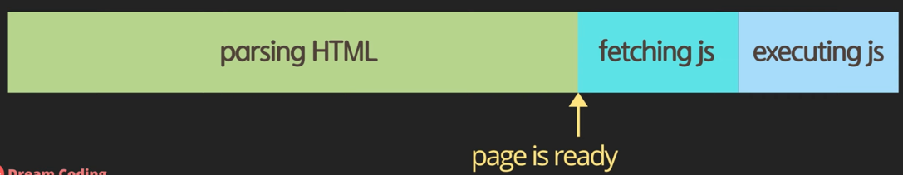
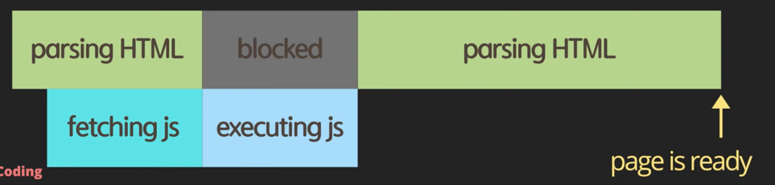
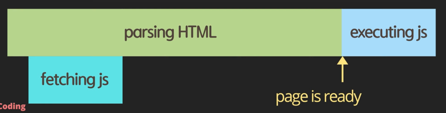
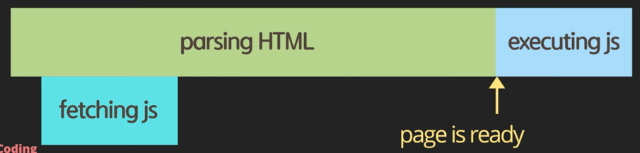
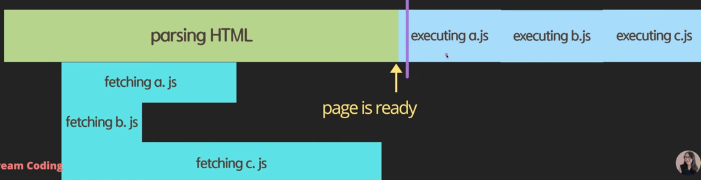

## script async 와 defer 의 차이점

### script 를 HTML 에 로드하는 4가지 방법

1. script 를 헤더에 배치하는 방법
```html
<!DOCTYPE html>
<html lang="en">
    <head>
        <meta charset="UTF-8">
        <meta name="viewport" content="width=device-width, initial-scale=1.0">
        <title>Document</title>
        <script src="main.js"></script>
    </head>
</html>
```
* script 를 헤더안에 배치하면 인터프리터에 의해 script 가 먼저 로드되어 실행된다.
* js 파일의 크기가 크다면 script 가 로드되는 동안 HTML 이 parsing 되기까지 시간이 오래 걸린다.
  


2. body 의 끝부분에 script 를 배치하는 방법
```html
<!DOCTYPE html>
<html lang="en">
    <head>
        <meta charset="UTF-8">
        <meta name="viewport" content="width=device-width, initial-scale=1.0">
        <title>Document</title>
    </head>
    <body>
        <div></div>
        <script src="main.js"></script>
    </body>
</html>
```
* script 가 body 의 끝부분에 배치되면 HTML 이 먼저 parsing 되어 사용자가 빠르게 컨텐츠를 볼 수 있다.
* 해당 페이지가 script 를 이용해서 동작하는 기능에 대해서는 script 가 로드되기 전까지 기다려야 하는 단점이 있다. 




3. head + async 를 활용하는 방법
```html
<!DOCTYPE html>
<html lang="en">
    <head>
        <meta charset="UTF-8">
        <meta name="viewport" content="width=device-width, initial-scale=1.0">
        <title>Document</title>
        <script async src="main.js"></script>
    </head>
</html>
```
* script 를 병렬적으로 fetching 하기 때문에 다운로드 받는 시간을 절약할 수 있다.
* script 가 html parsing 되기 먼저 실행되기 때문에, script 에서 HTML 의 DOM 요소를 조작하는 기능이 있다면 오동작을 하게 된다.  




4. head + defer
```html
<!DOCTYPE html>
<html lang="en">
    <head>
        <meta charset="UTF-8">
        <meta name="viewport" content="width=device-width, initial-scale=1.0">
        <title>Document</title>
        <script defer src="main.js"></script>
    </head>
</html>
```
* HTML 을 parsing 하는 동안 script 를 다운로드하고, HTML 이 모두 parsing 되었을 때 script 를 실행하므로 blocking 시간을 최소한으로 줄일 수 있다.  



* async 로 script 를 다운로드하게 되면, 순서에 상관없이 먼저 다운로드 된 순서대로 실행하기 때문에 script 가 선언 순서에 의존적인 상황이라면 문제가 발생할 수 있다.


* defer 은 HTML 이 parsing 되는 동안 fetching 을 하고, script 가 선언된 순서대로 실행된다.


---

## use strict

* ECMAScript 5에서 추가되었다.
* 선언되지 않은 변수에 값을 할당한다던지, 기존에 존재하는 prototype 을 변경하는 위험한 상황을 방지할 수 있다.
* 자바스크립트 엔진이 자바스크립트를 좀 더 빠르고 효율적으로 분석할 수 있기 때문에 성능상으로 유리하다.

---

## Data types, let vs var, hoisting

### block scope

* ES6 에서는 let 이라는 키워드로 변수를 선언한다.
* {} 안에서 변수를 선언하면 해당 블록 스코프 안에서만 접근이 가능하다. 가장 바깥에서 선언하면 global scope 로 어떤 위치에서든 접근이 가능하다.
* global scope 의 변수들은 어플리케이션이 시작부터 끝날 때까지 메모리에 살아있으므로 최대한 사용하지 않는 것이 좋다.
```javascript
{
    let name = 'foo'
    console.log(name)
}
// console.log(name) -> 블록 스코프 안에서만 유효하므로 name 변수에 접근 불가
```

### var 를 사용해서는 안되는 이유

1. js 에서는 변수를 선언도 하기 전에 값을 할당하여 사용할 수 있다. 그리고 사용도 가능하다.
   * let 을 이용하면 변수를 선언하기 전에 사용이 불가능하다.
   * var 가 선언도 하기 전에 사용가능한 이유는 hoisting 때문이다.
   * hoisting 은 어디에 선언했는지에 상관없이 선언을 제일 위로 끌어 올려주는 것이다.
2. var 는 block scope 이 없다.
   1. IE 를 제외한 major 브라우저에서는 es6 를 지원하므로 let 키워드를 사용할 수 있다.

### const

* 한 번 설정하면 변하지 않는 변수
* 불변성은 함수형 프로그래밍의 핵심이다.
```javascript
const number = 5
// number = 1 -> 값을 변경할 수 없다.
```

### variables type

* primitive
  * number, string, boolean, null, undefined, symbol
* object
* function
  * js 에서 함수는 first-class 이다.
* Infinity -> 양수 값을 0으로 나누었을 때
* -Infinity -> 음수 값을 0으로 나누었을 때
* NaN (Not a Number) -> 문자열을 숫자로 나누었을 때
* bigint -> 최근에 추가된 타입으로, 변수에 할당 가능한 최대의 숫자를 넘겨서 할당했을 때 타입이 지정된다.
  * 최근에 추가되었기 때문에 모든 브라우저에서 지원하지 않는다.

#### boolean

* false 로 인식하는 경우
  * 0, null, undefined, NaN, ''
* true 로 인식하는 경우
  * false 로 인식하는 경우를 제외한 모든 경우

#### null 과 undefined

* null
  * 명시적으로 비어있는 empty 값이라고 지정하는 경우다.
* undefined
  * 정의되지 않은 것
  * 초기화 되어 있지 않거나 존재하지 않은 객체의 프로퍼티 및 존재하지 않는 배열의 원소값에 접근하려고 할 때 얻어지는 변수의 값
  * 결과적으로 data type 이자, 값을 나타낸다.

#### symbol

* map 과 같은 자료구조에서 고유한 식별자를 필요로 할 때 사용한다.
* symbol 은 동일한 string 으로 작성했어도 서로 다른 symbol 로 만들어진다.
* 동일한 string 으로 동일한 symbol 을 만들고 싶다면 for() 메서드를 이용한다.
* symbol 을 출력할 때는 description 프로퍼티를 이용하여 출력한다.
```javascript
const symbol1 = Symbol('id');
const symbol2 = Symbol('id');
console.log(symbol1 === symbol2); //false

const gSymbol1 = Symbol.for('id');
const gSymbol2 = Symbol.for('id');
console.log(gSymbol1 === gSymbol2); //true

console.log(`${symbol1.description}`) //id
```

### dynamic typing

* 변수를 선언할 때 어떤 타입인지 선언하지 않고, 런타임에 할당된 값에 따라서 타입이 변경될 수 있다.
* 런타임에서 타입이 정해지기 때문에 예상치 못한 타입의 변경으로 인해 문제가 발생할 수 있다.

### Equality

* '==' 는 loose equality 이다.
  * 값을 비교할 때 타입을 변경하여 비교한다.
```javascript
const stringFive = '5';
const numberFive = 5;
console.log(stringFive == numberFive); //true
console.log(stringFive != numberFive); //false
```

* '===' 는 strict equality 이다.
  * 값을 비교할 때 타입까지 함께 비교한다. (타입이 다르면 false 이다.)
  * 왠만하면 strict equality 를 이용하여 비교하는 것이 좋다.
```javascript
const stringFive = '5';
const numberFive = 5;
console.log(stringFive === numberFive); //false
console.log(stringFive !== numberFive); //true
```

* object 와 같은 참조형은 레퍼런스 주소를 변수에 할당한다.
  * foo1 == foo2 는 두 객체의 레퍼런스 주소가 다르므로 false 이다.
  * foo1 === foo2 는 두 객체의 레퍼런스 주소가 다르므로 false 이다.
  * foo1 === foo3 는 두 객체의 레퍼런스 주소가 같고, 같은 타입이므로 true 이다.
```javascript
const foo1 = { name: 'hello' };
const foo2 = { name: 'hello' };
const foo3 = foo1
console.log(foo1 == foo2); //false
console.log(foo1 === foo2); //false
console.log(foo1 === foo3); //true
```

---

## 함수

* 함수는 오브젝트이다. 즉, 변수에 할당할 수도 있고, 파라미터로 전달하거나 리턴할 수도 있다.
* ES6 에서는 Default parameter 를 지정할 수 있다.
```javascript
function showMessage(message, from = 'unknown') {
    console.log(`${message} by ${from}`);
}
```
* Rest Parameter 를 통해서 가변 배열 형태의 파라미터를 전달할 수도 있다.
```javascript
function printAll(...args) {
    for (let i = 0; i < args.length; i++) {
        console.log(args[i]);
    }
}
printAll('hello', 'world', 'good')
```
* 함수 안에 또다른 함수를 정의할 수도 있다.
  * 안쪽 함수에서는 바깥쪽 함수의 로컬 스코프 변수를 참조할 수 있지만, 바깥쪽 함수에서는 안쪽 함수의 로컬 스코프 변수를 참조할 수 없다.
* 함수에 리턴이 명시되지 않았다면 undefined 를 리턴한다.
* 함수는 hoisting 이 되므로 정의되기 전에 호출이 되어도 동작한다.
* arrow function 은 항상 이름이 없는 익명 함수이며, () => expression 의 형태로 사용할 수 있다.
```javascript
const simplePrint = () => console.log('simplePring')
const multiLinePrint = (a, b) => {
    return a * b;
}
``` 

---

## 클래스 정리

* 클래스는 es6 부터 도입되어 사용되기 시작함.
* getter 와 setter 를 사용할 때는 콜스택이 오버플로우 되는 것을 주의해야 한다.
  * getter 와 setter 를 정의하면, 필드에 직접 접근하는 것이 아니라 getter 와 setter 에 접근하므로 무한 루프가 돌기 때문이다.
```javascript
class User {
    constructor(firstName, lastName, age) {
        this.firstName = firstName;
        this.lastName = lastName;
        this.age = age;
    }
    
    get age() {
        return this._age;
    }
    
    set age(value) {
        this._age = value;
    }
}
```
* 생성자가 아니라 필드로 선언하면 public, 해당 필드에 '#'을 붙이면 private 이다.
  * private 필드는 외부에서 접근할 수 없다.
* static 키워드를 사용하면 static 필드, 메서드를 선언할 수 있다.
* static 은 object 가 아니라 클래스를 통해서 접근이 가능하다.
* extends 키워드를 통해서 클래스를 상속할 수 있다.
* override 한 메서드라는 것을 명시적으로 나타낼 키워드는 없다.
* 슈퍼클래스에 접근할 때는 super 키워드를 사용한다.
* instanceof 는 클래스 타입을 체크할 수 있는 키워드이다.
