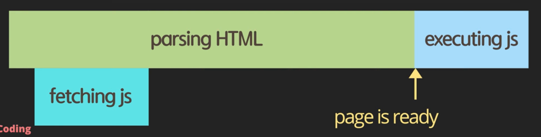
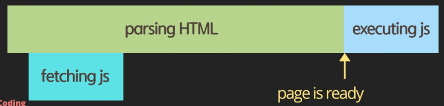
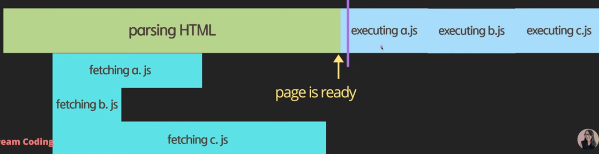

## script async 와 defer 의 차이점

### script 를 HTML 에 로드하는 4가지 방법

1. script 를 헤더에 배치하는 방법
```html
<!DOCTYPE html>
<html lang="en">
    <head>
        <meta charset="UTF-8">
        <meta name="viewport" content="width=device-width, initial-scale=1.0">
        <title>Document</title>
        <script src="main.js"></script>
    </head>
</html>
```
* script 를 헤더안에 배치하면 인터프리터에 의해 script 가 먼저 로드되어 실행된다.
* js 파일의 크기가 크다면 script 가 로드되는 동안 HTML 이 parsing 되기까지 시간이 오래 걸린다.
  


2. body 의 끝부분에 script 를 배치하는 방법
```html
<!DOCTYPE html>
<html lang="en">
    <head>
        <meta charset="UTF-8">
        <meta name="viewport" content="width=device-width, initial-scale=1.0">
        <title>Document</title>
    </head>
    <body>
        <div></div>
        <script src="main.js"></script>
    </body>
</html>
```
* script 가 body 의 끝부분에 배치되면 HTML 이 먼저 parsing 되어 사용자가 빠르게 컨텐츠를 볼 수 있다.
* 해당 페이지가 script 를 이용해서 동작하는 기능에 대해서는 script 가 로드되기 전까지 기다려야 하는 단점이 있다. 


3. head + async 를 활용하는 방법
```html
<!DOCTYPE html>
<html lang="en">
    <head>
        <meta charset="UTF-8">
        <meta name="viewport" content="width=device-width, initial-scale=1.0">
        <title>Document</title>
        <script async src="main.js"></script>
    </head>
</html>
```
* script 를 병렬적으로 fetching 하기 때문에 다운로드 받는 시간을 절약할 수 있다.
* script 가 html parsing 되기 먼저 실행되기 때문에, script 에서 HTML 의 DOM 요소를 조작하는 기능이 있다면 오동작을 하게 된다.  


4. head + defer
```html
<!DOCTYPE html>
<html lang="en">
    <head>
        <meta charset="UTF-8">
        <meta name="viewport" content="width=device-width, initial-scale=1.0">
        <title>Document</title>
        <script defer src="main.js"></script>
    </head>
</html>
```
* HTML 을 parsing 하는 동안 script 를 다운로드하고, HTML 이 모두 parsing 되었을 때 script 를 실행하므로 blocking 시간을 최소한으로 줄일 수 있다.  



* async 로 script 를 다운로드하게 되면, 순서에 상관없이 먼저 다운로드 된 순서대로 실행하기 때문에 script 가 선언 순서에 의존적인 상황이라면 문제가 발생할 수 있다.


* defer 은 HTML 이 parsing 되는 동안 fetching 을 하고, script 가 선언된 순서대로 실행된다.


### use strict
* ECMAScript 5에서 추가되었다.
* 선언되지 않은 변수에 값을 할당한다던지, 기존에 존재하는 prototype 을 변경하는 위험한 상황을 방지할 수 있다.
* 자바스크립트 엔진이 자바스크립트를 좀 더 빠르고 효율적으로 분석할 수 있기 때문에 성능상으로 유리하다.
